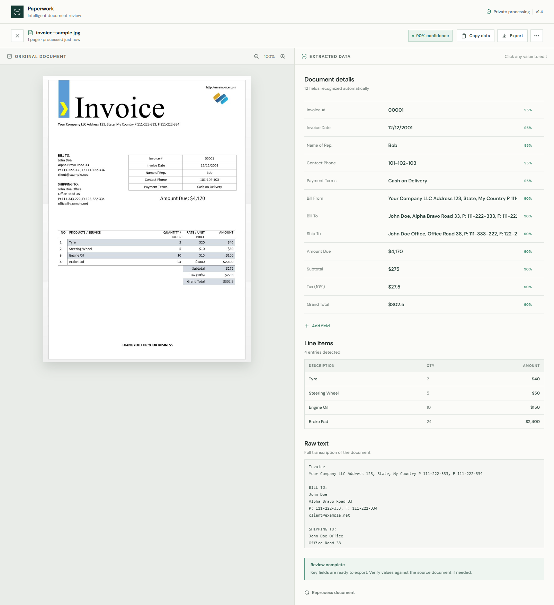
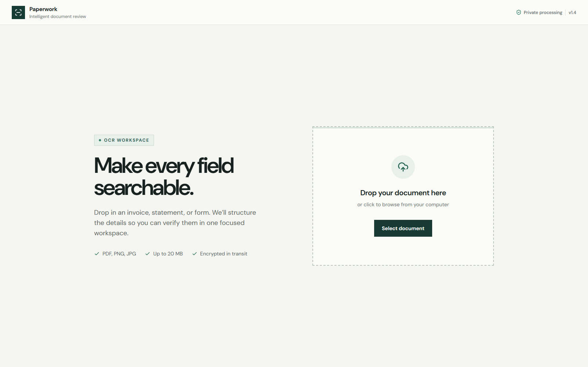

# Paperwork — OCR-Free

Turn a photo or PDF of an invoice, receipt, statement, or form into
structured, editable data — without any cloud OCR API. A local vision
language model reads the document and returns labeled fields, line
items, and a full text transcription, all reviewable and editable in a
single-page workspace before you export.



<details>
<summary>Upload screen</summary>



</details>

## How it works

```
┌──────────┐  upload   ┌───────────────┐  page image(s)  ┌──────────────────┐
│  Browser │ ────────► │ FastAPI backend│ ──────────────► │ Vision LLM        │
│ (Vite/   │           │  (Backend/)    │                 │ (Ollama / vLLM,   │
│  React)  │ ◄──────── │                │ ◄────────────── │ OpenAI-compatible)│
└──────────┘  fields,  └───────────────┘  structured JSON └──────────────────┘
              line items,
              raw text
```

1. The **Frontend** (React + Vite) lets you drop in a `.pdf`, `.png`, or
   `.jpg` file and renders the extracted result next to the original
   document.
2. The **Backend** (FastAPI) converts PDF pages to images if needed and
   sends them to a vision-capable LLM with a structured-extraction
   prompt, then validates and returns the response as JSON.
3. Any OpenAI-compatible chat completions endpoint works — the default
   is a local [Ollama](https://ollama.com) server running
   `qwen2.5vl:7b`, so documents never leave your machine.

## Features

- Drag-and-drop or click-to-upload for PDF / PNG / JPG (multi-page PDFs supported)
- Automatic extraction of header fields (invoice number, dates, payment
  terms, Bill To / Bill From / Ship To, totals, and any other labeled
  field on the document)
- Line-item table detection (description, quantity, amount)
- Full raw-text transcription of the document
- Per-field confidence scores
- Click-to-edit on every field's label and value, plus **Add field** to
  add anything the model missed
- Copy extracted data or export the full result as JSON
- Runs entirely locally — no document data leaves your machine

## Project layout

```
Backend/    FastAPI app: upload handling, PDF-to-image conversion, OCR prompt + parsing
Frontend/   React + Vite + Tailwind single-page workspace
run-dev.sh  Runs both together for local development
```

See [Backend/README.md](Backend/README.md) for API details and
[Frontend/README.md](Frontend/README.md) for frontend-specific notes.

## Getting started

### Prerequisites

- Python 3.11+
- Node.js 18+
- [Ollama](https://ollama.com) (or any OpenAI-compatible vision model server)

### 1. Backend

```bash
cd Backend
python -m venv .venv
.venv\Scripts\activate        # Windows; use `source .venv/bin/activate` on macOS/Linux
pip install -r requirements.txt
copy .env.example .env         # `cp` on macOS/Linux
```

Pull the OCR model and start the backend:

```bash
ollama pull qwen2.5vl:7b
uvicorn app.main:app --reload --port 8080
```

### 2. Frontend

```bash
cd Frontend
npm install
npm run dev
```

Open `http://localhost:5173`.

### Or run both together

```bash
./run-dev.sh
```

(Requires the backend virtualenv and frontend `node_modules` to already
be set up as above.)

## API

`POST /api/ocr/process` — multipart upload with a `file` field, returns:

```json
{
  "document_name": "invoice.pdf",
  "page_count": 1,
  "overall_confidence": 95,
  "fields": [{ "label": "Invoice #", "value": "00001", "confidence": 95 }],
  "line_items": [{ "description": "Tyre", "quantity": "2", "amount": "$40" }],
  "raw_text": "..."
}
```

`GET /api/health` — backend status and configured OCR model.

## Tech stack

- **Backend:** FastAPI, Pydantic, OpenAI Python SDK (used against any
  OpenAI-compatible endpoint), Pillow / pdf2image for PDF handling
- **Frontend:** React, TypeScript, Vite, Tailwind CSS, Framer Motion
- **OCR model:** `qwen2.5vl:7b` via Ollama by default; swappable via
  `OCR_BASE_URL` / `OCR_MODEL_NAME`

## License

No license has been specified yet — add one (e.g. MIT) if you intend to share or accept contributions.
